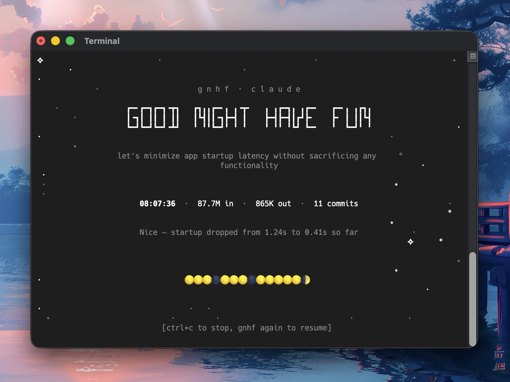

<p align="center">Before I go to bed, I tell my agents:</p>
<h1 align="center">good night, have fun</h1>

<p align="center">
  <a href="https://www.npmjs.com/package/gnhf"
    ></a>
  <a href="https://github.com/kunchenguid/gnhf/actions/workflows/ci.yml"
    ></a>
  <a href="https://github.com/kunchenguid/gnhf/actions/workflows/release-please.yml"
    ></a>
  <a
    href="https://img.shields.io/badge/platform-macOS%20%7C%20Linux-blue?style=flat-square"
    ></a>
  <a href="https://x.com/kunchenguid"
    ></a>
  <a href="https://discord.gg/Wsy2NpnZDu"
    ></a>
</p>

<p align="center">
  
</p>

gnhf is a [ralph](https://ghuntley.com/ralph/), [autoresearch](https://github.com/karpathy/autoresearch)-style orchestrator that keeps your agents running while you sleep — each iteration makes one small, committed, documented change towards an objective.
You wake up to a branch full of clean work and a log of everything that happened.

- **Dead simple** — one command starts an autonomous loop that runs until you Ctrl+C or a configured runtime cap is reached
- **Long running** — each iteration is committed on success, rolled back on failure, with sensible retries and exponential backoff
- **Agent-agnostic** — works with Claude Code, Codex, Rovo Dev, or OpenCode out of the box

## Quick Start

```sh
$ gnhf "reduce complexity of the codebase without changing functionality"
# have a good sleep
```

```sh
$ gnhf "reduce complexity of the codebase without changing functionality" \
    --max-iterations 10 \
    --max-tokens 5000000
# have a good nap
```

Run `gnhf` from inside a Git repository with a clean working tree. If you are starting from a plain directory, run `git init` first.

## Install

**npm**

```sh
npm install -g gnhf
```

**From source**

```sh
git clone https://github.com/kunchenguid/gnhf.git
cd gnhf
npm install
npm run build
npm link
```

If you want to run `gnhf --agent rovodev`, install Atlassian's `acli` and authenticate it with Rovo Dev first.

If you want to run `gnhf --agent opencode`, install `opencode` and authenticate at least one provider first.

## How It Works

```
                    ┌─────────────┐
                    │  gnhf start │
                    └──────┬──────┘
                           ▼
                ┌──────────────────────┐
                │  validate clean git  │
                │  create gnhf/ branch │
                │  write prompt.md     │
                └──────────┬───────────┘
                           ▼
              ┌────────────────────────────┐
              │  build iteration prompt    │◄──────────────┐
              │  (inject notes.md context) │               │
              └────────────┬───────────────┘               │
                           ▼                               │
              ┌────────────────────────────┐               │
              │  invoke your agent         │               │
              │  (non-interactive mode)    │               │
              └────────────┬───────────────┘               │
                           ▼                               │
                    ┌─────────────┐                        │
                    │  success?   │                        │
                    └──┬──────┬───┘                        │
                  yes  │      │  no                        │
                       ▼      ▼                            │
              ┌──────────┐  ┌───────────┐                  │
              │  commit  │  │ git reset │                  │
              │  append  │  │  --hard   │                  │
              │ notes.md │  │  backoff  │                  │
              └────┬─────┘  └─────┬─────┘                  │
                   │              │                        │
                   │   ┌──────────┘                        │
                   ▼   ▼                                   │
              ┌────────────┐    yes   ┌──────────┐         │
              │ 3 consec.  ├─────────►│  abort   │         │
              │ failures?  │          └──────────┘         │
              └─────┬──────┘                               │
                 no │                                      │
                    └──────────────────────────────────────┘
```

- **Incremental commits** — each successful iteration is a separate git commit, so you can cherry-pick or revert individual changes
- **Runtime caps** — `--max-iterations` stops before the next iteration begins, while `--max-tokens` can abort mid-iteration once reported usage reaches the cap; uncommitted work is rolled back in either case
- **Shared memory** — the agent reads `notes.md` (built up from prior iterations) to communicate across iterations
- **Local run metadata** — gnhf stores prompt, notes, and resume metadata under `.gnhf/runs/` and ignores it locally, so your branch only contains intentional work
- **Resume support** — run `gnhf` while on an existing `gnhf/` branch to pick up where a previous run left off

## CLI Reference

| Command                   | Description                                     |
| ------------------------- | ----------------------------------------------- |
| `gnhf "<prompt>"`         | Start a new run with the given objective        |
| `gnhf`                    | Resume a run (when on an existing gnhf/ branch) |
| `echo "<prompt>" \| gnhf` | Pipe prompt via stdin                           |
| `cat prd.md \| gnhf`      | Pipe a large spec or PRD via stdin              |

### Flags

| Flag                   | Description                                                | Default                |
| ---------------------- | ---------------------------------------------------------- | ---------------------- |
| `--agent <agent>`      | Agent to use (`claude`, `codex`, `rovodev`, or `opencode`) | config file (`claude`) |
| `--max-iterations <n>` | Abort after `n` total iterations                           | unlimited              |
| `--max-tokens <n>`     | Abort after `n` total input+output tokens                  | unlimited              |
| `--version`            | Show version                                               |                        |

## Configuration

Config lives at `~/.gnhf/config.yml`:

```yaml
# Agent to use by default (claude, codex, rovodev, or opencode)
agent: claude

# Abort after this many consecutive failures
maxConsecutiveFailures: 3
```

If the file does not exist yet, `gnhf` creates it on first run using the resolved defaults.

CLI flags override config file values. The iteration and token caps are runtime-only flags and are not persisted in `config.yml`.

When using `agent: rovodev`, `gnhf` starts a local `acli rovodev serve --disable-session-token <port>` process automatically in the repo workspace. That requires `acli` to be installed and already authenticated for Rovo Dev.

When using `agent: opencode`, `gnhf` starts a local `opencode serve --hostname 127.0.0.1 --port <port> --print-logs` process automatically, creates a per-run session for the target workspace, and applies a blanket `{"permission":"*","pattern":"*","action":"allow"}` rule so tool calls do not block on prompts. That requires the `opencode` CLI to be installed and already configured with a usable model provider.

## Development

```sh
npm run build          # Build with tsdown
npm run dev            # Watch mode
npm test               # Run tests (vitest)
npm run lint           # ESLint
npm run format         # Prettier
```
